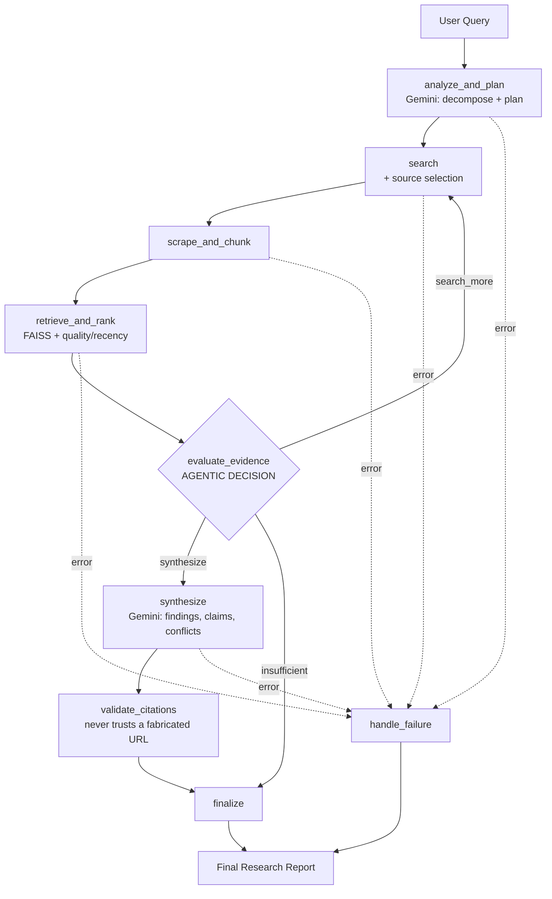

# Intelligent Web Research Agent

An AI-powered research application that takes a complex question, decomposes it, searches the web, scrapes and verifies evidence, detects conflicting information, and synthesizes a structured, cited report — built with a genuinely agentic (not fixed-pipeline) LangGraph workflow, a FastAPI backend, and a vanilla HTML/CSS/JS frontend.

> Ask: *"Compare the latest RAG evaluation methods, their advantages and disadvantages, and recommend which approach is most suitable for production."*
> Get: an executive summary, key findings, a comparison table, flagged conflicts between sources, and a claim-by-claim citation trail — never a fabricated source.

---

## 1. Project overview

The agent runs a bounded, multi-step research loop:

1. **Understand & plan** — Gemini decomposes the question into sub-questions and search queries.
2. **Search & select sources** — a pluggable `SearchProvider` (Tavily by default) finds candidate URLs; the agent dedupes and ranks them.
3. **Scrape & clean** — pages are fetched safely (SSRF-guarded, timeout-bound), stripped of boilerplate/ads/scripts, and chunked.
4. **Embed & retrieve** — chunks are embedded (Sentence-Transformers) and semantically ranked (FAISS) against the original question, blended with a transparent source-quality heuristic and recency.
5. **Decide** — the agent evaluates whether the evidence is actually sufficient. If not (and budget remains), it loops back with a refined query. This is a real decision point, not a fixed number of steps.
6. **Synthesize & validate** — Gemini synthesizes a report (summary, findings, comparison table, claims, conflicts) from the retrieved evidence only; a deterministic citation-validation step then strips any citation that doesn't point to evidence the agent actually retrieved. **The system never lets an LLM invent a source.**

---

## 2. Architecture



**Layering**: `api/` (FastAPI routes, thin) → `services/research_service.py` (the only bridge to the agent) → `agent/graph.py` + `agent/nodes.py` (LangGraph orchestration) → `services/*.py` (search, scraper, embedding, retrieval, source-quality, citation, Gemini — each independently testable) → `db/` (SQLAlchemy + repository pattern).

The frontend polls `GET /api/research/{id}` while a background task runs the graph, rendering the *actual* progress log returned by the API — nothing is simulated client-side.

---

## 3. Technology stack

| Layer | Choice | Why |
|---|---|---|
| Backend | FastAPI + Pydantic + Uvicorn | async-friendly, typed, auto `/docs` |
| Agent orchestration | LangGraph (`StateGraph`) | real branching/looping state machine, not a wrapper around a fixed call sequence |
| LLM | Google Gemini (`google-genai` SDK) | structured JSON output via `response_schema` |
| Web search | Tavily (`tavily-python`), behind an abstract `SearchProvider` | free developer tier, LLM-oriented results; swappable |
| Scraping | httpx + BeautifulSoup4 | async-capable HTTP, robust HTML parsing |
| Embeddings | Sentence-Transformers (`all-MiniLM-L6-v2`) | small, fast, good-enough local embeddings, CPU-only |
| Vector search | FAISS (`IndexFlatIP`) | exact cosine similarity via inner product on normalized vectors, no external service needed |
| Database | SQLite + SQLAlchemy | zero-setup local persistence; swappable for Postgres via `DATABASE_URL` |
| Frontend | HTML5 + CSS3 + vanilla JS | no framework, no build step, per project requirements |

---

## 4. Folder structure

```
web-research-agent/
├── backend/
│   ├── app/
│   │   ├── main.py                 # FastAPI app, CORS, lifespan, static frontend mount
│   │   ├── api/                    # health.py, research.py, history.py — thin routes only
│   │   ├── core/                   # config.py (env settings), logging.py
│   │   ├── models/                 # SQLAlchemy ORM (research.py)
│   │   ├── schemas/                # Pydantic request/response contracts
│   │   ├── services/                # search, scraper, embedding, retrieval,
│   │   │                            # source_quality, citation, gemini, research_service
│   │   ├── agent/                  # state.py, nodes.py, graph.py — the LangGraph agent
│   │   ├── db/                     # database.py, repository.py
│   │   └── utils/                  # text_cleaner.py, validators.py
│   ├── tests/                      # 32 tests: agent, api, scraper, retrieval
│   ├── requirements.txt
│   └── Dockerfile
├── frontend/
│   ├── index.html                  # research dashboard
│   ├── history.html                # past research runs
│   ├── css/style.css
│   └── js/{app.js, history.js}
├── eval/                           # evaluation dataset + script (Batch 6+)
├── .env.example
├── .dockerignore
├── docker-compose.yml
└── README.md
```

---

## 5. Environment variables

Copy `.env.example` to `.env` and fill in real values:

| Variable | Required | Description |
|---|---|---|
| `GEMINI_API_KEY` | Yes | From https://aistudio.google.com/apikey |
| `SEARCH_API_KEY` | Yes | Tavily key, from https://tavily.com |
| `GEMINI_MODEL` | No (default `gemini-2.5-flash`) | Any current Gemini model name |
| `CORS_ORIGINS` | No | Comma-separated allowed origins; matters only if you serve the frontend from a different port than the backend |
| `DATABASE_URL` | No (default local SQLite file) | Overridden automatically by `docker-compose.yml` to use the persistent volume |

The app **boots and serves traffic without either key configured** — it just returns a clear, specific error (`GEMINI_API_KEY is not configured...`) the moment a research run actually needs that provider, instead of crashing or silently failing. A placeholder value left over from `.env.example` (e.g. `your_gemini_api_key_here`) is also correctly treated as "not configured," not as a real key.

---

## 6. Running locally (no Docker)

```bash
cd backend
python -m venv .venv && source .venv/bin/activate

# Install CPU-only PyTorch FIRST — sentence-transformers depends on torch,
# and without this step pip pulls the full ~5GB CUDA build you don't need.
pip install torch --index-url https://download.pytorch.org/whl/cpu
pip install -r requirements.txt

cp ../.env.example .env   # then edit .env with your real keys
uvicorn app.main:app --reload --host 0.0.0.0 --port 8000
```

Open **http://localhost:8000** — the backend serves the frontend directly from the same process.

To instead serve the frontend separately during development (e.g. to test from a different port):
```bash
cd frontend
python -m http.server 5500
# open http://localhost:5500/index.html — app.js falls back to
# http://localhost:8000/api automatically when not served from :8000
```

---

## 7. Running with Docker

```bash
cp .env.example .env   # then edit .env with your real keys
docker compose up --build
```

Open **http://localhost:8000**.

- **Single container**: the same FastAPI process serves both the API and the frontend (no separate nginx/static service — unnecessary for this project's size).
- **CPU-only PyTorch**: `backend/Dockerfile` installs the CPU wheel from PyTorch's dedicated index *before* `requirements.txt`, so the image never pulls the CUDA build.
- **Persistence**: a named Docker volume (`research_data`) is mounted at `/data`; `docker-compose.yml` points `DATABASE_URL` there automatically, so research history survives `docker compose down` / restarts.
- **Healthcheck**: the container reports healthy only once `GET /api/health` responds — check with `docker compose ps`.
- **No secrets in the image**: the Dockerfile never references any API key; real values are injected at *runtime* via `env_file: .env` in `docker-compose.yml`. `.dockerignore` explicitly excludes `.env` from the build context.

To stop (keeping data): `docker compose down`
To stop and wipe research history: `docker compose down -v`

---

## 8. API endpoints

| Method | Path | Description |
|---|---|---|
| `GET` | `/api/health` | Service status + whether Gemini/Search keys are configured |
| `POST` | `/api/research` | Start a research run; returns `{id, status, query}` immediately, runs in the background |
| `GET` | `/api/research/{id}` | Poll status/progress; returns the full report once `status == "completed"` |
| `GET` | `/api/research` | Paginated history (`?limit=&offset=`) |
| `DELETE` | `/api/research/{id}` | Delete a research record |

Full interactive docs at **`/docs`** (Swagger UI) once the server is running.

**Example**:
```bash
curl -X POST http://localhost:8000/api/research \
  -H "Content-Type: application/json" \
  -d '{"query": "Compare the latest RAG evaluation methods for production use"}'
# -> {"id": "...", "status": "pending", "query": "..."}

curl http://localhost:8000/api/research/<id>
# -> poll until status is "completed" or "failed"
```

---

## 9. How the agentic workflow works

This is **not** a fixed sequence of API calls. The LangGraph state machine has one real decision point, `evaluate_evidence`, which after every retrieval pass decides between three branches:

- **`search_more`** — evidence is empty or below a sufficiency threshold, and budget remains → loop back to `search` with either the next planned query or a Gemini-generated refinement query, `iteration += 1`.
- **`synthesize`** — evidence looks sufficient → proceed to report generation.
- **`insufficient`** — budget (`max_iterations`, `max_search_queries`, or a wall-clock timeout) is exhausted with no usable evidence → skip synthesis and return an honest "insufficient evidence" report instead of fabricating an answer.

Every node persists its own error into the shared state rather than crashing the process; a conditional edge routes any node's failure straight to `handle_failure`, so a single bad search/scrape/LLM call fails the run cleanly with a clear message instead of taking down the server.

**Untrusted content handling**: scraped web page text is explicitly wrapped in delimiters and labeled as untrusted, non-instructional data in the prompt sent to Gemini (a defense against prompt injection from a malicious page). The *hard* guarantee, though, is deterministic: `citation_service` discards any citation pointing to a URL that wasn't actually retrieved as evidence, regardless of what the LLM outputs — proven under test even against a simulated "compromised" LLM response.

---

## 10. How RAG works here

```
Scraped pages → clean text → paragraph-aware overlapping chunks (with metadata)
    → Sentence-Transformers embeddings → FAISS IndexFlatIP (cosine via inner product)
    → query embedding → top-K retrieval
    → re-ranked by semantic score + source-quality boost + recency boost
    → passed to Gemini as labeled, delimited evidence blocks (SOURCE_ID + URL + title)
    → Gemini's claims are validated against the retrieval set before being shown to the user
```

Every retrieved chunk keeps its original `source_url`, `title`, and `source_domain` all the way through — retrieval never discards provenance, which is what makes citation validation possible at all.

---

## 11. Troubleshooting

| Symptom | Cause / Fix |
|---|---|
| Research immediately fails with "GEMINI_API_KEY is not configured" | Expected if `.env` still has the placeholder value — add a real key |
| `pip install` pulls a multi-GB download | You skipped the CPU-torch step — install `torch --index-url https://download.pytorch.org/whl/cpu` *before* `pip install -r requirements.txt` |
| Frontend can't reach the API when served on a different port | Check `CORS_ORIGINS` in `.env` includes that origin, e.g. `http://localhost:5500` |
| `docker compose ps` shows the container as `unhealthy` | Check `docker compose logs app` — usually a missing/invalid `.env` or a port conflict on 8000 |
| Research history disappears after `docker compose down` | You likely ran `docker compose down -v`, which also removes the named volume |
| Tests fail locally | Make sure you're running `pytest` from `backend/` — external SDKs are stubbed via `tests/conftest.py`, no real API keys needed to run the test suite |

---

## 12. Limitations

- **Search provider**: Tavily's free tier has rate limits; heavy usage may need a paid plan or a different `SearchProvider` implementation.
- **Source-quality scoring is a transparent heuristic**, not a certified authority measure — it's a small, auditable domain-pattern list (see `source_quality_service.py`), not an ML classifier.
- **Conflict detection, claim mapping, and synthesis share one Gemini call** (not three separate calls) for latency/cost reasons — documented as a deliberate tradeoff, not an oversight.
- **SQLite** is intentionally simple for local/single-instance use; swap `DATABASE_URL` for Postgres if you need concurrent multi-instance writes.
- **No authentication/multi-tenancy** — this is a single-user local research tool, not a hosted multi-user product, as shipped.
- Prompt-injection defenses (evidence delimiting + instruction to ignore embedded commands) reduce but cannot perfectly eliminate the risk of a malicious page influencing the LLM's *prose* — the citation-validation layer is what provides the hard guarantee against fabricated *sources*, not the prompt wording alone.
